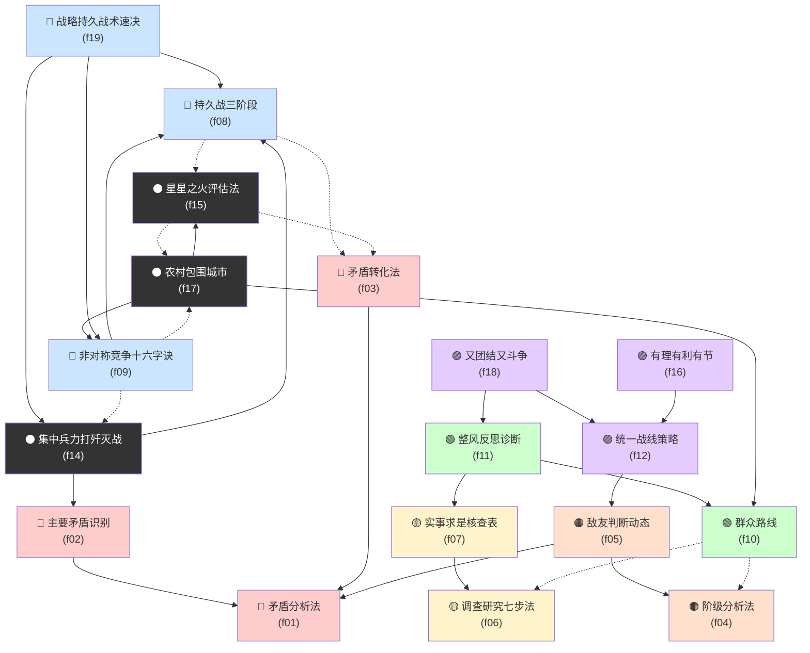

# 毛泽东选集 — Skill Index

> 本书由 book2skill 蒸馏共产出 **18** 个 skills。
> 处理时间: 2026-04-21

## 关于这本书

- **作者**: 毛泽东
- **出处**: 毛泽东选集（卷1-7 + 静火版卷8-9）
- **一句话主旨**: 从1925年到1949年的革命战争中，提炼出一套可操作的方法论体系——从矛盾识别到战略执行的完整闭环
- **整书理解**: 见 [BOOK_OVERVIEW.md](./books/maoxuan/BOOK_OVERVIEW.md)

---

## Skill 列表（按主题分组）

### 🔴 矛盾分析法体系（核心框架）

- [`maoxuan-contradiction-analysis`](./skills/f01-矛盾分析法/SKILL.md) — 识别主要矛盾与矛盾主要方面的核心框架
- [`maoxuan-primary-contradiction`](./skills/f02-主要矛盾识别法/SKILL.md) — 在多重问题中找到"解决了其他都会消解"的那个
- [`maoxuan-contradiction-transformation`](./skills/f03-矛盾转化法/SKILL.md) — 判断强者变弱、弱者变强的量变质变节点

### 🟠 敌友判断体系

- [`maoxuan-class-analysis`](./skills/f04-阶级分析法/SKILL.md) — 以利益关系而非感情判断敌友，绘制阶级光谱
- [`maoxuan-enemy-friend-dynamics`](./skills/f05-敌友判断动态框架/SKILL.md) — 敌友关系随主要矛盾变化而动态调整

### 🟡 调查研究体系

- [`maoxuan-investigation-research`](./skills/f06-调查研究七步法/SKILL.md) — 从定问题到成方案的完整调研流程
- [`maoxuan-fact-seeking`](./skills/f07-实事求是核查表/SKILL.md) — 决策前核查"有没有脱离实际"的检查清单

### 🔵 持久战战略体系

- [`maoxuan-persistence-war`](./skills/f08-持久战三阶段框架/SKILL.md) — 防御→相持→反攻的三阶段判断模型
- [`maoxuan-asymmetric-competition`](./skills/f09-非对称竞争十六字诀/SKILL.md) — 敌进我退、敌驻我扰、敌疲我打、敌退我追
- [`maoxuan-strategy-tactics-dual-track`](./skills/f19-战略持久战术速决/SKILL.md) — 战略持久与战术速决的双轨运行原则

### 🟢 群众与组织体系

- [`maoxuan-mass-line`](./skills/f10-群众路线决策法/SKILL.md) — 从群众中来、到群众中去的决策循环
- [`maoxuan-introspection-criticism`](./skills/f11-整风反思诊断法/SKILL.md) — 从三风诊断识别组织深层问题

### 🟣 统一战线体系

- [`maoxuan-unity-front`](./skills/f12-统一战线策略/SKILL.md) — 动态管理敌友边界、扩大阵营的策略工具
- [`maoxuan-struggle-unite`](./skills/f18-又团结又斗争/SKILL.md) — 团结为目的、斗争为手段的动态平衡
- [`maoxuan-rational-advantage-limit`](./skills/f16-有理有利有节/SKILL.md) — 谈判/博弈中道义、实利、节制的分寸把握

### ⚫ 战略执行体系

- [`maoxuan-concentrated-force`](./skills/f14-集中兵力打歼灭战/SKILL.md) — 资源有限时集中优势兵力打歼灭战
- [`maoxuan-spark-fire`](./skills/f15-星星之火评估法/SKILL.md) — 评估新生力量"有没有戏"的四维判断
- [`maoxuan-surround-countryside`](./skills/f17-农村包围城市/SKILL.md) — 不争最强，先占最弱的弱者战略总框架

---

## 关系图



图例:
- 实线箭头 → depends-on（依赖）
- 虚线箭头 -.-> composes-with（配合使用）
- 同色系属于同一主题

---

## 推荐学习顺序

（从基础到应用，从简单到复杂）

**第一阶段：方法论基础**（学会"怎么看问题"）

1. **[矛盾分析法](skills/f01-矛盾分析法/SKILL.md)** — 毛选方法论的皇冠，先学这个
2. **[阶级分析法](skills/f04-阶级分析法/SKILL.md)** — 判断敌友的利器，与矛盾分析并行

**第二阶段：调查工具**（学会"怎么获取事实"）

3. **[调查研究七步法](skills/f06-调查研究七步法/SKILL.md)** — 任何重大决策前的标准准备
4. **[实事求是核查表](skills/f07-实事求是核查表/SKILL.md)** — 决策前检查"有没有脱离实际"

**第三阶段：矛盾深化**（学会"找到重点"）

5. **[主要矛盾识别法](skills/f02-主要矛盾识别法/SKILL.md)** — 矛盾分析法的核心操作步骤
6. **[矛盾转化法](skills/f03-矛盾转化法/SKILL.md)** — 判断力量对比何时逆转

**第四阶段：战略框架**（学会"制定方向"）

7. **[持久战三阶段框架](skills/f08-持久战三阶段框架/SKILL.md)** — 最完整的战略分析框架
8. **[敌友判断动态框架](skills/f05-敌友判断动态框架/SKILL.md)** — 敌友关系随格局变化而调整

**第五阶段：具体战术**（学会"怎么打"）

9. **[非对称竞争十六字诀](skills/f09-非对称竞争十六字诀/SKILL.md)** — 弱者的战术工具箱
10. **[星星之火评估法](skills/f15-星星之火评估法/SKILL.md)** — 评估新生力量是否值得押注

**第六阶段：组织与联盟**（学会"怎么管人"）

11. **[群众路线决策法](skills/f10-群众路线决策法/SKILL.md)** — 从群众中来、到群众中去的决策循环
12. **[整风反思诊断法](skills/f11-整风反思诊断法/SKILL.md)** — 组织层面的定期健康检查
13. **[统一战线策略](skills/f12-统一战线策略/SKILL.md)** — 动态管理敌友边界的策略工具

**第七阶段：高级应用**（学会"怎么组合"）

14. **[又团结又斗争](skills/f18-又团结又斗争/SKILL.md)** — 统一战线的核心操作原则
15. **[有理有利有节](skills/f16-有理有利有节/SKILL.md)** — 谈判/博弈的分寸把握
16. **[集中兵力打歼灭战](skills/f14-集中兵力打歼灭战/SKILL.md)** — 资源分配的优先级原则
17. **[农村包围城市](skills/f17-农村包围城市/SKILL.md)** — 弱者战略的总框架
18. **[战略持久战术速决](skills/f19-战略持久战术速决/SKILL.md)** — 战略与战术的双轨运行

---

## 接入 darwin-skill

所有 skill 均带有 `test-prompts.json`（darwin-skill 兼容格式，可直接接入自动进化）：
```
darwin evolve mao-skill/
```

---

## 审计轨迹

| 阶段 | 内容 | 状态 |
|------|------|------|
| 阶段0 | 全书骨架理解 + 候选池识别 | ✅ 完成 |
| 阶段1 | 5个并行提取器（框架/原则/案例/反例/术语） | ✅ 完成 |
| 阶段1.5 | 三重验证 + 补漏4个框架 | ✅ 完成 |
| 阶段2 | RIA++ Skill构造（18个skill） | ✅ 完成 |
| 阶段3 | Zettelkasten链接 + INDEX | ✅ 完成 |
| 阶段4 | 压力测试（test-prompts.json） | ✅ 完成 |

- 候选池: [books/maoxuan/candidates/](./books/maoxuan/candidates/)
- 提取器方法论: [books/maoxuan/extractors/](./books/maoxuan/extractors/)
- BOOK_OVERVIEW: [books/maoxuan/BOOK_OVERVIEW.md](./books/maoxuan/BOOK_OVERVIEW.md)
